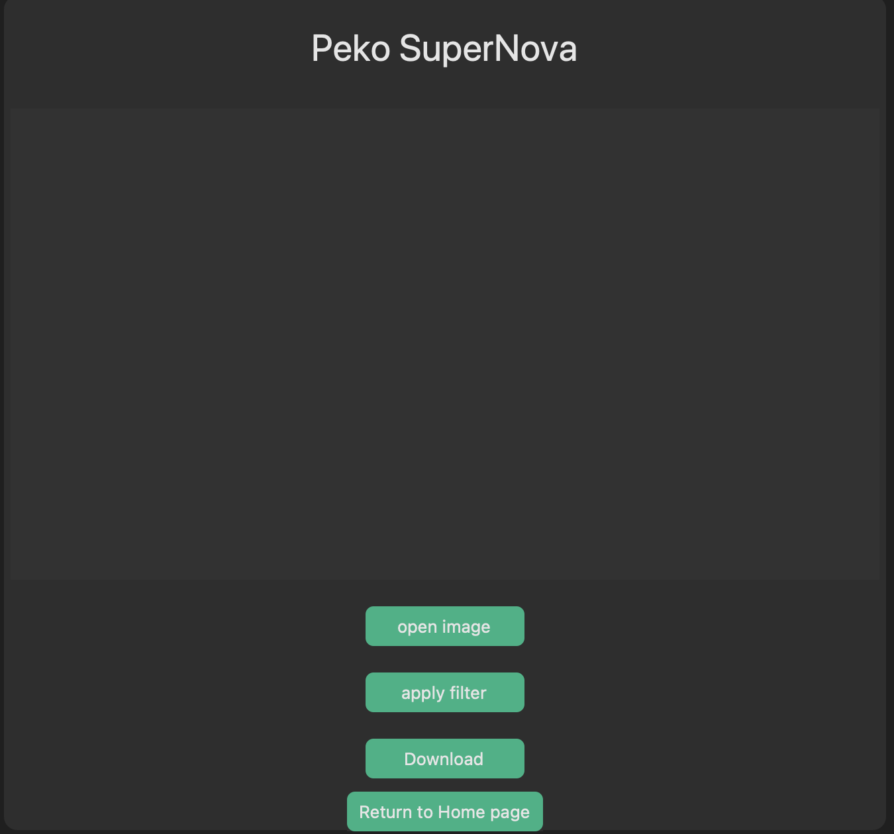

# Peko app

## Table of contents
- [Peko app](#peko-app)
  - [Table of contents](#table-of-contents)
  - [General info](#general-info)
  - [Setup](#setup)
  - [App Features](#app-features)
- [Resourses](#resourses)


## General info
This python project provides some basic images filters and basic image meta extraction with a smooth GUI.


## Setup
1. install the task requirements
```
pip install -r requirements.txt
```
2. run the script
```
python main.py
```

## App Features
1. Image Meta Extactor
    # extract basic meta data from a selected image
    
    

2. Peko superNova
    # apply combination of filters to the selected image
     * applied fliters
       * Saturation
       * Contrast
       * Brightness
    
    
    

3. Black&White filter
    # apply black and white filter to the selected image
    
    

4. Copyright page
    # copyright page to reserve all the rights to the peko app developers
   

# Resourses
* Frames swithing mechanism code -> https://stackoverflow.com/questions/7546050/switch-between-two-frames-in-tkinter